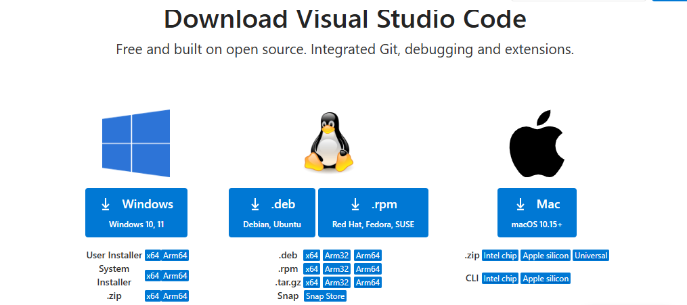
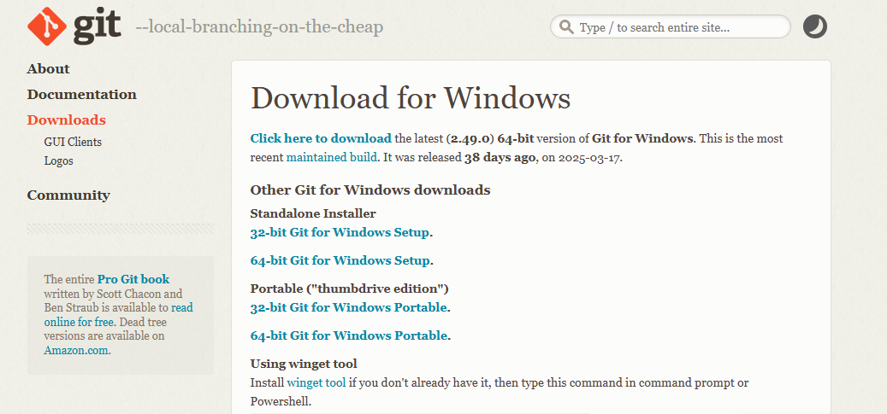
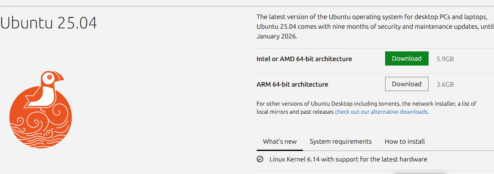
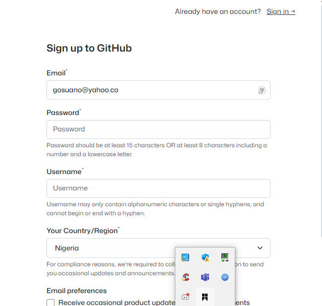
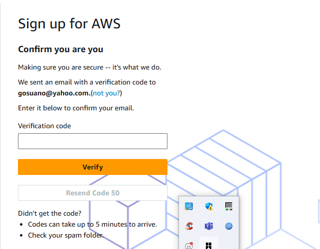

# Git_Mini_Project

This mini project is to demonstrate signed up accounts for development tools and software installations for devops training.

firstly, vscode have already been downloaded and installed for this work to be executed.

secondly, git was downloaded and installed.

thirdly, visual c++  was downloaded and installed before virtualbox installation this was because the windows prompted for it for its compatiblity,thereafter virtualbox was downloaded and installed fully operational.

fourthly, Ubuntu 22.04 was downloaded and installed in virtualbox and its fully operational after setting my user in the sudoers file.

the github and aws accounts are successfuly signed up which is what is enabling execution of this project.

Below are the screenshots of all the outlines processes of the acounts sign up and software installations.

## VSCODE
[VSCODE_INSTALLATION](./img/VSCODE_Installation.png)[VSCODE_INSTAL](./img/Vscode_instal.png)

## GIT
[git_installation](./img/git_installation.png)[gitbash_version](./img/gitbash_version.png)

## VISUAL C++ AND VIRTUALBOX
[visualc++_installation](./img/VISUALC++_install.png)[visualc++_completeinst](./img/VISUALC++_success.png)[virtualbox_download](./img/VIRTUALBOX_Donwload.png)[virtualbox_installation](./img/VIRTUALBOX_install.png)[virtualbox_complete](./img/VIRTUALBOX.png)

## UBUNTU
[unbuntu_installation](./img/Ubuntu_Install2.png)[Ubuntu_complete](./img/ubuntu_login.png)[ubuntu_login](./img/Ubuntu_complete_installation.png)

## GITHUB
[github_profile](./img/github_Profile.png)[github_dashboad](./img/github_dashboard.png)

## AWS
[AWS_acct](./img/AWS_account_info.png)[AWS_management](./img/AWS_MANAGEMENT.png)